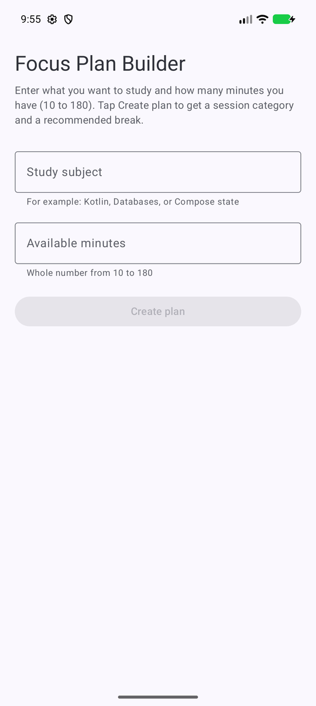
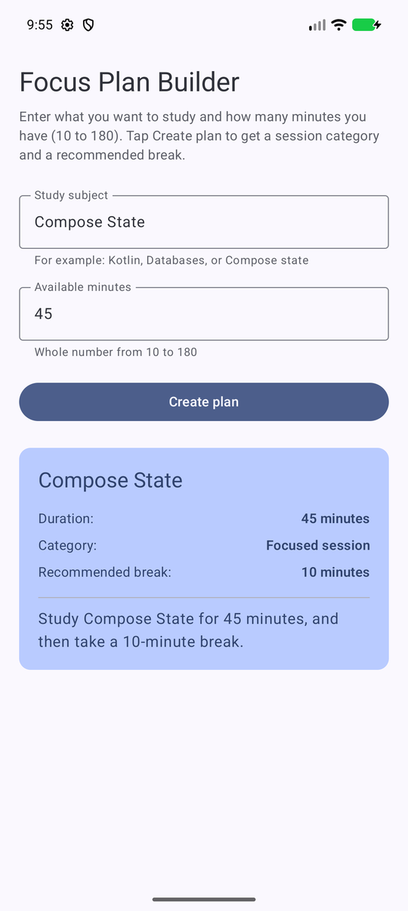
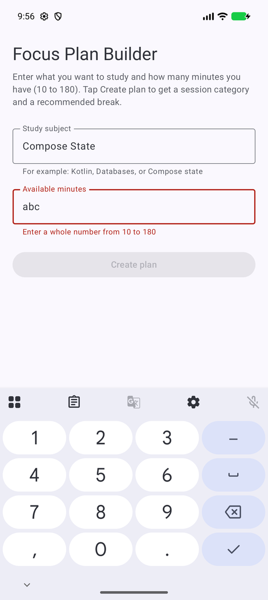
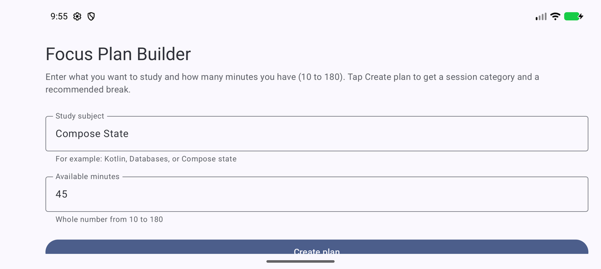

# Focus Plan Builder

**Author:** Srinivasa Sai Chava
**BU ID:** U44607487
**Course:** CS501 – Individual Coding Assignment 2: Focus Plan Builder
**Package name:** `edu.bu.saichava.focusplanbuilder`

---

## Description

Focus Plan Builder is a single-screen Android application, written in Kotlin with Jetpack Compose and Material 3, that helps a student build a focused study plan. The user enters a study subject and the number of minutes available. The app validates both inputs live, keeps the **Create plan** button disabled until they are valid, and then shows a result card containing:

- the cleaned (trimmed) subject
- the session duration
- a duration category (_Quick review_, _Focused session_ or _Extended session_)
- a recommended break (5, 10 or 15 minutes)
- a one-sentence summary, e.g. _Study Compose State for 45 minutes, and then take a 10-minute break._

Editing either field removes the previous result card, and both inputs (plus the generated plan) survive device rotation.

---

## Running the Application

### Android Studio

1. Clone the repository and open the `Focus_Plan_Builder` folder in Android Studio (Kotlin DSL project, AGP 9.4.1, Kotlin 2.2.10, Gradle 9.6.0).
2. Let Gradle sync finish.
3. Select a phone emulator (or device) running **API 26 or newer** and press **Run ▶**.

### Command line

```bash
./gradlew installDebug
```

### Tests

```bash
# Local JVM unit tests for durationCategory() and recommendedBreak()
./gradlew testDebugUnitTest

# Compose UI tests for every row of the required test table (needs a running emulator)
./gradlew connectedDebugAndroidTest
```

### Emulator used for verification

- **Device:** Pixel 10 Pro
- **API level:** 37 (Android 17)

### SDK configuration

| Setting      | Value |
| ------------ | ----- |
| `minSdk`     | 26    |
| `targetSdk`  | 37    |
| `compileSdk` | 37    |

---

## Screenshots

| Initial screen (button disabled, no card)            | Completed plan                                   |
| ---------------------------------------------------- | ------------------------------------------------ |
|  |  |

| Invalid duration: inline error, button disabled, old card removed |
| ----------------------------------------------------------------- |
|                 |

| After rotating the emulator: both inputs (and the plan) are preserved |
| --------------------------------------------------------------------- |
|               |

---

## Project Structure

```
Focus_Plan_Builder/
├── app/
│   ├── src/main/
│   │   ├── java/edu/bu/saichava/focusplanbuilder/
│   │   │   ├── MainActivity.kt            # hosts FocusPlanRoute inside a Scaffold
│   │   │   ├── FocusPlanRoute.kt          # owns state, validates input, builds the FocusPlan
│   │   │   ├── FocusPlanScreen.kt         # stateless UI: fields, button, result Card
│   │   │   ├── FocusPlan.kt               # data class FocusPlan(subject, minutes, category, breakMinutes)
│   │   │   ├── FocusPlanCalculations.kt   # durationCategory() and recommendedBreak()
│   │   │   └── ui/theme/                  # Color.kt, Theme.kt, Type.kt
│   │   ├── res/values/strings.xml         # all user-facing text
│   │   └── AndroidManifest.xml
│   ├── src/test/.../FocusPlanCalculationsTest.kt   # JVM unit tests (9 tests)
│   ├── src/androidTest/.../FocusPlanScreenTest.kt  # Compose UI tests (19 tests)
│   └── build.gradle.kts
├── gradle/libs.versions.toml
├── screenshots/
└── README.md
```

### Key implementation points

- **Two-level composables.** `FocusPlanRoute(modifier)` owns the state and passes values plus callbacks to `FocusPlanScreen(subject, minutesText, plan, onSubjectChange, onMinutesChange, canCreatePlan, onCreatePlan, modifier, subjectError, minutesError)`. The two extra Boolean parameters only drive the red inline hints; they are derived in the Route like everything else.
- **Null-safe parsing.** `val minutes: Int? = minutesText.toIntOrNull()` – `toInt()` is never called on user input.
- **Derived button state.** `val canCreatePlan = subject.isNotBlank() && minutes != null && minutes in MIN_MINUTES..MAX_MINUTES` (10..180). No separate mutable Boolean exists.
- **`when` expressions.** `durationCategory()` returns `"Invalid"`, `"Quick review"`, `"Focused session"` or `"Extended session"`; `recommendedBreak()` returns 5, 10 or 15.
- **Reset behaviour.** Both `onSubjectChange` and `onMinutesChange` set `plan = null`, so the card disappears the moment an input changes.
- **Layout.** `Column` for the screen, `Spacer`s between elements, `Row`s for the label/value lines inside the Material 3 `Card`; the column scrolls so it stays usable in landscape and with the keyboard open.

---

## State and Recomposition

**Which composable owns the application state?** `FocusPlanRoute` owns all of it: `subject`, `minutesText` and the nullable `plan`. `FocusPlanScreen` is stateless; it receives those values as parameters and reports typing and button taps back through the `onSubjectChange`, `onMinutesChange` and `onCreatePlan` callbacks (state hoisting).

**Why are the text-field values stored as `String` rather than `Int`?** A text field always produces text, and while the user is typing it is often not a valid number at all: empty, `abc`, or half-typed. Keeping the raw `String` preserves exactly what the user sees and defers interpretation to validation time.

**Why is `toIntOrNull()` safer than `toInt()`?** `toInt()` throws `NumberFormatException` for anything that is not a well-formed integer, which would crash the app on `abc` or an empty field. `toIntOrNull()` returns `null` instead, so invalid input simply means "no minutes yet" and is handled with a null check.

**What state change causes the button to be recomposed?** `canCreatePlan` is computed from `subject` and `minutesText` during composition. Writing to either `MutableState` invalidates `FocusPlanRoute`; Compose re-runs it, recalculates `canCreatePlan`, and the `Button` is recomposed with the new `enabled` value, so nothing is kept in sync manually.

**What does `rememberSaveable` preserve that a local variable would not?** A plain local variable is recreated on every recomposition. `remember` survives recomposition but is lost when the Activity is destroyed and recreated on rotation. `rememberSaveable` additionally stores the value in the saved-instance-state `Bundle`, so the typed subject and minutes reappear after rotation (the plan does too, through a small custom `Saver`).

---

## Manual Test Results

All cases were run on the Pixel 10 Pro emulator; the same cases are automated in `FocusPlanScreenTest`.

| Subject | Duration | Expected result                   | Result |
| ------- | -------- | --------------------------------- | ------ |
| _blank_ | 25       | Button disabled                   | Pass   |
| Kotlin  | _blank_  | Button disabled                   | Pass   |
| Kotlin  | abc      | Button disabled; no crash         | Pass   |
| Kotlin  | 9        | Button disabled                   | Pass   |
| Kotlin  | 10       | Quick review; 5-minute break      | Pass   |
| Kotlin  | 29       | Quick review; 5-minute break      | Pass   |
| Kotlin  | 30       | Focused session; 10-minute break  | Pass   |
| Kotlin  | 60       | Focused session; 10-minute break  | Pass   |
| Kotlin  | 61       | Extended session; 15-minute break | Pass   |
| Kotlin  | 180      | Extended session; 15-minute break | Pass   |
| Kotlin  | 181      | Button disabled                   | Pass   |

Also verified: erasing the duration does not crash the app; both inputs survive rotation; the old result disappears when an input changes; the button's enabled state updates automatically as the input changes.

---

## Collaboration Disclosure

I did not collaborate with any classmates on this assignment.

---

## Generative AI Disclosure

**Tool or model used:** Claude Code (Claude Opus 5), an AI coding assistant developed by Anthropic, used through the Claude desktop app.

**Prompts:** I have Completed my project, i want you to help me with any syntax errors and warnings in the code. Is my readme perfect with grammar or do i need to make any changes ?

**Relevant suggestions it produced:** It helped with the errors in the syntax i got while writing the Reset Behaviour. It also corrected the grammar and spacing in the README.

**What I accepted, changed, or rejected:** I accepted the changes it made to remove the warnings of unused packaged. I accepted the README changes and formatting myself.

**How I confirmed my understanding:** I reviewed the submitted code line by line, ran the application on the emulator, tested the required input cases, and verified the state-hoisting, validation, rememberSaveable, and recomposition behavior. I can explain how each composable, callback, calculation function, and state variable works.
